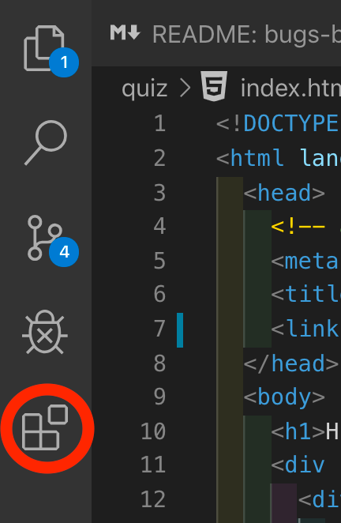

****************************************
Installation l'éditeur vscode pour ROS2
****************************************

Nous utilisons un bon éditeur de code (très important pour la productivité) qui est `vscode <https://code.visualstudio.com/>`_ de Github.

=======================
Installation de vscode
=======================

Aller sur le site de `vscode <https://code.visualstudio.com/>`_ et télécharger la version correspondant à ubuntu 22.04

Aller dans le répertoire de configuration des paramètres globaux de vscode pour l'utilisateur courant et créer un fichier ``keybindings.json`` vide:

.. code-block:: bash

   cd ~/.config/Code/User
   touch keybindings.json

Vous allez ouvrir le fichier ``keybindings.json`` (que vous venez de créer dans votre dossier home ``~/.config/Code/User``) et le remplir avec le contenu suivant:

.. literalinclude:: resources/code/config.vscode/keybindings.json
   :language: json
   :caption: Fichier keybindings.json
   :linenos:

La configuration des racourcis claviers avec ce fichier permet de:

- supprimer le racourcis ``Ctrl+q`` (lignes 2-5) qui est utilisé par vscode pour fermer l'éditeur. Les lettres ``a``, ``z`` et ``s`` entourant la lettre ``q`` sur un clavier AZERTY de francophone, cela permet de ne pas fermer l'éditeur par erreur en voulant par exemple:

   - taper ``Ctrl+a`` pour sélectionner tout le texte ou
   - taper ``Ctrl+z`` pour annuler une action ou
   - taper ``Ctrl+s`` pour sauvegarder le fichier.

- supprimer un bug lié à l'extension esbonio permettant d'afficher la documentation sphinx dans vscode (lignes 6-9).

Recharger vscode pour prendre en compte ces changements en tapant ``Ctrl+Shift+P`` puis en tapant ``Developer: Reload Window``.

Le fichier des racourcis claviers ne se trouve pas dans le répertoire du projet mais dans le répertoire de configuration des paramètres globaux de vscode pour l'utilisateur courant car ces paramètres sont considérés par vscode comme étant des paramètres régionaux et/ou spécifiques à l'utilisateur.
Il est possible d'utiliser une extension qui permet de définir des profils et de les utiliser en fonction du projet ou de l'environnement de travail.

=================================
Configurer un projet vscode ROS2
=================================

Pour un projet avec vscode, il faut configurer certains paramètres pour que l'éditeur soit adapté à ROS2 et de manière plus générale, avoir certains settings pour une meilleure productivité.

Pour cela, dans un nouveau projet, il faut créer un dossier ``.vscode`` à la racine du projet et y ajouter un fichier ``settings.json`` avec le contenu suivant:

.. literalinclude:: resources/code/config.vscode/settings.json
   :language: json
   :caption: Fichier settings.json
   :linenos:

Les options de ce fichier permettent:

- de formatter les fichier à chaque sauvegarde avec les outils de formattage automatique mais aussi lors des copiés-collés (lignes 2-4). Cela est particulièrement utile pour les languages où l'indentation a un sens pour le compilateur comme le python, restructuredText, yaml, etc.
- de faire en sorte que le code soit toujours entièrement visible même quand la fenêtre est trop petite en «wrapant» les lignes dans l'éditeur mais pas dans le fichier (lignes 5). Cela se voit car le numéro de ligne ne change pas à gauche.
- de faire en sorte que l'indentation soit toujours faite avec des espaces en restructuredText (.rst, le format des fichiers de documentation sphinx de ce cours) (lignes 13-15).
- de ne pas réarranger l'ordre des include en C/C++ (ligne 6), ce qui peut conclure à des erreurs pour certains setups de compilation, notamment dans la programmation embarquée.
- d'ignorer l'erreur E402 en python pour pouvoir importer des modules n'importe où dans le code (lignes 7-10)
- d'augmenter la taille de l'historique du terminal (ligne 11)
- de laisser les fichiers consultés ouverts dans l'éditeur quand ils ont été ouverts par des actions de preview (ligne 12), comme par exemple pour consulter une ligne liée à une erreur dans un log ou un processus de compilation. Cela permet d'avoir en simultané le fichier de log ou d'erreur et le fichier de code ouvert dans l'éditeur.

======
Tests
======

Pour ouvrir le répertoire courant avec vscode:

.. code-block:: bash

   code .

===================================
Installation des extensions vscode
===================================

Dans vscode vous allez cliquer sur l'icone 

.. _vscode_extension_icon:

   Clickez sur l'icone Extensions

Et vous allez installer les extensions suivantes qui seront très utile pour le cours:

Édition de code:
^^^^^^^^^^^^^^^^
#. Gremlins tracker par Nicolas Hoizey

   - ID: nhoizey.gremlins
   - permet de voir tous les charactères invisibles dans le code qui peuvent nous pourrir la vie

git:
^^^^
#. Git Graph par mhutchie

   - ID: mhutchie.git-graph

python:
^^^^^^^
#. Python par microsoft

   - ID: ms-python.python
#. Python Debugger par microsoft

   - ID: ms-python.debugpy

Documentation:
^^^^^^^^^^^^^^
#. Esbonio par Swyddfa

   - ID: swyddfa.Esbonio

c/c++/ embarqué:
^^^^^^^^^^^^^^^^
#. C/C++ par microsoft

   - ID: ms-vscode.cpptools

#. GDB Debugger - Beyond par coolchyni

   - ID: coolchyni.beyond-debug

#. vscode-valgrind par krosf

   - ID: krosf.vscode-valgrind

#. CMake Tools par microsoft

   - ID: ms-vscode.cmake-tools

#. Debug Visualizer par Henning Dieterichs 

   - ID: hediet.debug-visualizer

#. Hex Array Formatter par AloyseTech

   - ID: AloyseTech.hex-array-formatter

ROS2:
^^^^^
#. Uncrustify par Zachary Flower

   - ID: zachflower.uncrustify
   - permet de bien formatter des fichiers ROS2

#. ROS2 par nonanonno 

   - ID: nonanonno.vscode-ros2
   - permet de la coloration syntaxique pour les fichiers ROS2

#. ROS2 par JaehyunShim

   - ID: jaehyunshim.vscode-ros2
   - permet d'utiliser des pattern de code ROS2 et de les ajouter dans son code rapidement

#. ROS 2 Ament Task Provider par Allison Thackston

   - ID: althack.ament-task-provider
   - ajoute des tâches automatiques notamment pour tester le formattage des fichiers ROS2

Assistant IA:
^^^^^^^^^^^^^
#. GitHub Copilot par github

   - ID: GitHub.copilot
