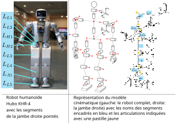

**********************************************************
Modéliser la géométrie d'un robot rigide avec URDF et SDF
**********************************************************

On ne considère ici que les robots rigides, c'est-à-dire un système composé de 
parties rigides qui se meuvent les unes par rapport aux autres.
On exclut donc les robots avec des parties souples comme par exemple 
un système dont 2 parties rigides seraient reliées par un élastique.

On sépare un modèle de robot rigide en 2 catégories de parties :

#. les ``segments`` (``link`` en anglais) qui correspondent aux parties rigides du robot et 
#. les articulations (``joint`` en anglais) qui correspondent aux mouvements possibles entre deux parties rigides. 

Entre 2 segments (notés L sur la :numref:`fig_robot_modeling_slide001`)
, on a toujours une articulation (notées par des pastilles jaunes, sur la :numref:`fig_robot_modeling_slide001`).

   Modéle géométrique de la cinématique d'un robot rigide (source: :cite:`Ali2010_closed_form_inverse_kinematic_joint_solution_for_humanoid_robots`)

On peut aussi trouver le mot ``liaison`` pour une articulation en référence aux liaisons mécaniques (liaison glissière, pivot, etc. cf. `les 12 types de liaisons mécaniques <https://fr.wikipedia.org/wiki/Liaison_(m%C3%A9canique)>`_) cependant à cause de la proximité avec le mot ``link`` nous préférons utiliser le mot ``articulation``.

D'un point de vue cinématique, on utilise le plus courament 3 types d'articulations parmi les 12 types de liaisons mécaniques :

.. grid:: 1 1 1 1

   .. grid-item::

      .. grid:: 1 3 3 3

         .. grid:: 1 1 1 1

            .. grid-item-card::
               
               .. figure:: resources/fig/asy/mechanical_joints/prismatic_joint_logo.svg
                  :name: fig_prismatic_joint_logo
                  :align: center
                  :height: 150px

                  Glissière

            .. grid-item::
               :margin: 2 0 0 0
               :padding: 0 0 5 0

               | (``prismatic joint`` en anglais)

         .. grid:: 1 1 1 1

            .. grid-item-card::
               
               .. figure:: resources/fig/asy/mechanical_joints/revolute_joint_logo.svg
                  :name: fig_revolute_joint_logo
                  :align: center
                  :height: 150px

                  Pivot d'axe

            .. grid-item::
               :margin: 2 0 0 0
               :padding: 0 0 5 0
            
               | (``revolute joint`` en anglais)
         
         .. grid:: 1 1 1 1
            
            .. grid-item-card::

               .. figure:: resources/fig/asy/mechanical_joints/rigid_joint_logo.svg
                  :name: fig_rigid_joint_logo
                  :align: center
                  :height: 150px

                  Encastrement

            .. grid-item::
               :margin: 2 0 0 0
               :padding: 0 0 5 0

               | (``fixed or rigid joint`` en anglais)
         
   .. grid-item::
      :class: center-text
         
         Symboles 2D des articulations les plus courantes pour un robot

L'objectif du modèle géométrique est de pouvoir décrire la position dans l'espace de chaque 
segment du robot au cours du temps en prenant en compte les mouvements faits par les articulations.

En tant que travail de modélisation, il est critique d'identifier les parties du modèle
qui peuvent présenter les écarts les plus importants avec la réalité.

=========
Segments
=========

Un segment est une partie rigide du robot, soit un solide.
Il est défini par sa géométrie, c'est-à-dire ses surfaces (Représentation par les Bords ou `B-Rep <https://fr.wikipedia.org/wiki/B-Rep>`_) et son échelle.
Ses surfaces peuvent être fournies de manière :

#. implicite: zéros d'équations mathématiques. Par exemple pour une sphère :math:`f(x, y, z) = x^2+y^2+z^2-r^2 = 0`.
#. analytique: par les équations des surfaces. Par exemple pour une sphère: :math:`(x, y, z) = (r \cos(\theta) \sin(\phi), r \sin(\theta) \sin(\phi), r \cos(\phi))`.
#. discrétisée: par un maillage constitué de polygones, ou de paramètres de méthodes constructives comme des B-splines, surfaces de Bézier ou NURBS.

Une combinaison des 3 types de représentations est possible pour représenter un segment.

Il y a plusieurs types d'approximations dans la modélisation d'un segment :

#. la géométrie modélisée est différente de la géométrie réelle du segment à cause du processus de fabrication de ce dernier et des tolérances de fabrication.
#. si la géométrie est discrétisée alors la densité du maillage est une approximation de la réalité. Dans ce cas il peut s'agir d'un scan du segment mais aussi d'une représentation qui différe du processus de fabrication (par exemple un cylindre discrétisé, alors que la pièce a été réalisée avec un tour).
#. la rigidité du segment est une approximation de la réalité. En effet aucune matière n'est parfaitement rigide.

Dans ROS un segment peut être défini de 2 manières:

#. par une des 3 primitives géométriques : pavé droit, cylindre ou sphère
#. par un fichier de maillage au format `collada <https://www.khronos.org/collada/>`_ (fichier d'extension `.dae`)

Il est possible et facile d'exporter un fichier de maillage step ou stl en fichier collada.
De nombreux logiciels de CAO permettent d'exporter un modèle en fichier collada.

En particulier le logiciel libre `FreeCAD <https://www.freecadweb.org/>`_ permet d'exporter un modèle en fichier collada.

.. _export_dae_avec_freecad:
.. tabs::

   .. tab:: Procédure animée d'export avec Freecad version 0.21.2

      En partant d'un modèle de robot complet au format step, on va chercher à exporter seulement un segment du robot.
      
      :download:`maquette-5-barres_asm.stp <resources/3d/maquette-5-barres_asm.stp>`
      
      Lancer freecad depuis un terminal:

      .. code-block:: bash

         freecad maquette-5-barres_asm.stp

      .. figure:: resources/img/export_dae.gif
         :align: center
         :width: 80%
      
      Vous pouvez télécharger le fichier collada généré:
      
      :download:`one_arm.dae <resources/3d/link1.dae>`

Le format collada est très intéressant car très complet. 
Il contient bien sûr la géométrie 3D du segment (en de nombreux formats BREP, y compris B-spline et NURBS), mais peut également contenir des informations:

#. de couleur des surfaces,
#. de transparence des volumes,
#. de texture,
#. matériaux par face,
#. pofiles de matériaux avec des paramètres de Phong, Lambert pour les équations d'éclairage,
#. de normales, binormales, tangentes, coordonnées de texture, couleurs associés aux sommets des surfaces,
#. on peut même ajouter des attributs customisés aux sommets des surfaces, permettant de réaliser des calculs spécifiques, notamment pour la simulation.

Cela permet une visualisation plus réaliste du segment et en particulier que des modèles d'éclairage soient pris en compte.

==============
Articulations
==============

Parmi toutes les articulations rigides nous utilisons principalement:

#. L'articulation glissière qui permet un mouvement de translation sans rotation entre deux segments rigides.  Le mouvement linéaire peut être réalisé par une glissière, un vérin ou une crémaillère par exemple.
#. L'articulation pivot d'axe qui permet un mouvement de rotation sans translation. C'est le type des articulations utilisées dans un bras robotique anthropomorphe. La notation symbolique en 3D est un cylindre autour de l'axe de rotation comme dans la jambe du robot humanoïde de la :numref:`fig_robot_modeling_slide001`.
#. La dernière articulation est un cas particulier, elle correspond à une liaison mécanique qui ne permet aucun mouvement relatif entre les deux segments. Elle peut être réalisée par une soudure, un boulonnage ou un collage entre deux pièces par exemple. Un exemple est donné par la liaison encastrement entre le segment :math:`L_{L1}` et le segment :math:`L_{L2}` de la :numref:`fig_robot_modeling_slide001`.

D'un point de vue pratique, on peut s'interroger sur pourquoi ne pas avoir un seul segment 
composé de l'union des 2 segments impliqués dans la liaison encastrement plutôt qu'une articulation
puisque le mouvement relatif est nul.
Cette articulation est fondamentale car elle sert à modéliser 
un assemblage rigide de segments distincts. |br|
Or nous savons que notre modèle n'est qu'une approximation et en particulier que les informations disponibles sur l'assemblage (la position relative d'un segment par rapport à l'autre) peuvent être d'une part imprécises et d'autre part peuvent varier au cours du temps.
Cela est donc essentiel de pouvoir modifier la position relative des segments pour prendre en compte ces imprécisions en utilisant des procédures de calibration. |br|
En particulier, si l'assemblage est soumis à un stress mécanique, il est intéressant d'avoir la possibilité de changer la position relative de l'assemblage pour prendre en compte les déformations liées à ce stress.
Ainsi, s'il on est capable de réaliser un tracking dynamique de la position relative des segments, le fait d'avoir représenté la liaison encastrement par une articulation permet d'obtenir un modéle du robot adaptable et donc fidèle au cours du temps.