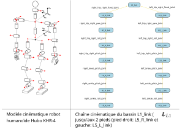

=================================
Descriptions de robots avec ROS2
=================================

Le but de la description d'un robot est d'avoir un modèle servant à la fois à la simulation et au contrôle du robot:

#. visualiser le robot et ses configurations géométriques,
#. calculer la position des segments du robot en fonction des articulations,
#. faire intéragir le robot dans un environnement de simulation et récupérer des données capteurs, des données de collisions, des informations de position, vitesse, accélération et force exercées (entre autre sur les articulations et les segments du robot),

Les descriptions de robots sont faites dans des fichiers de description de robot.
Nous utiliserons 2 formats XML dans ROS: URDF et SDF.

Ces fichiers décrivent principalement les paramètres suivants:
   
   #. les segments du robot:

      #. pour la visualisaiton
         
         #. géometrie (:code:`<geometry>`),
         #. origine (position et orientation d'un repère différent du repère d'origine du segment)
         #. matériel (principalement la couleur)
      
      #. pour le calcul de collision

         #. géometrie (:code:`<geometry>`) souvent une géométrie simplifiée pour accélérer les calculs,
         #. origine (position et orientation d'un repère différent du repère d'origine du segment)

      #. paramètres d'inértie

         #. masse,
         #. `centre d'inertie <https://fr.wikipedia.org/wiki/Centre_d%27inertie>`_ (centre de gravité),
         #. `matrice d'inertie <https://fr.wikipedia.org/wiki/Moment_d%27inertie>`_

   #. les articulations entre les pairs de segments reliés,

      #. nom
      #. type (prismatique, pivot d'axe, rigide, etc.)
      #. parent et enfant (les 2 segments reliés)
      #. origine (la transformation entre les 2 segments avant qu'aucun mouvement ne soit appliqué)
      #. limites de mouvement (limites de position, vitesse, accélération, force, etc.)
      #. axe du mouvement

---------------------
Chaînes cinématiques
---------------------

Le passage du repère d'un segment à un autre suite à la transformation appliquée par l'articulation reliant les 2 segment constitue la transformation cinématique élémentaire de la chaîne cinématique du robot.

   Arbre des chaînes cinématiques des jambes du robot Hubo KHR-4, un robot humanoïde non parallèle, (source: :cite:`Ali2010_closed_form_inverse_kinematic_joint_solution_for_humanoid_robots` .)

Le premier segment de la chaîne cinématique est appelé la racine de la chaîne cinématique.

La racine de la chaîne cinématique est un segment fixe par rapport au repère de modélisation, souvent appelé repère monde (world en anglais).
Le sens des flêches indique quel est le repère de référence pour la position et l'orientation du segment suivant.
Dans les paramètres de description ci-dessus, la flêche va de l'enfant vers le parent.