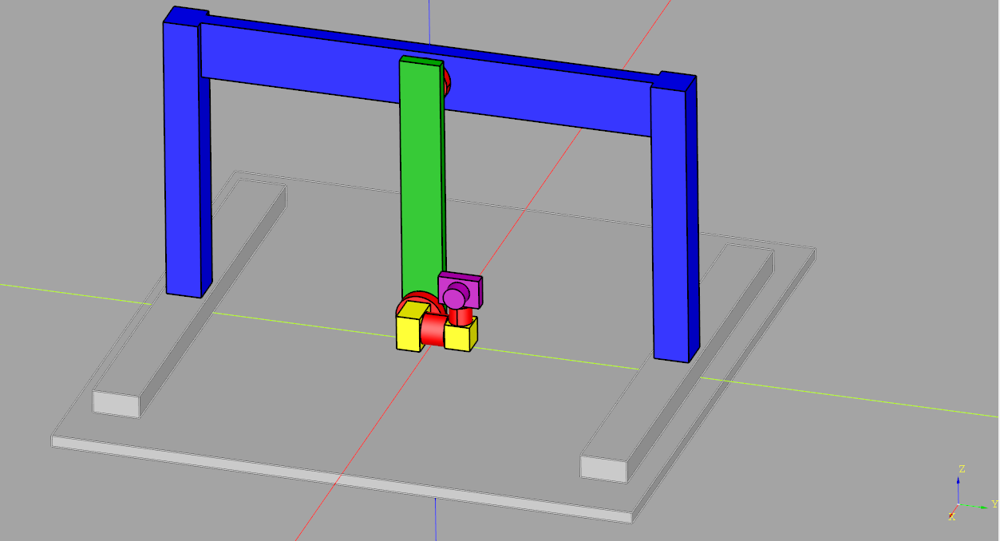

======================
Robots non parallèles
======================

   Robot Scanbot, le robot d'exemple non parallèle

Dans le cas d'un robot non parallèle, les chaînes cinématiques sont ouvertes et on peut représenter l'ensemble des chaînes cinématiques du robot par un arbre, le chemin en ligne directe de la racine à une feuille de l'arbre correspondant à une chaîne cinématique.

Le format utilisé pour décrire les robots non parallèle dans ROS est l'URDF.

------------------------------------
Description de robot au format URDF
------------------------------------

La syntaxe URDF
^^^^^^^^^^^^^^^^
L'URDF est basé sur le format XML, les éléments d'information sont organisés grâce à des balises :code:`<balise> élément </balise>`, qui peuvent être imbriquées. 
En anglais une balise est appelée un **tag**.

**Tag**
Un tag est une construction de balisage qui commence par :code:`<`` et se termine par :code:`>`. Il existe trois types de tag :

#. tag de début, tel que :code:`<section>`,
#. tag de fin, tel que :code:`</section>`,
#. tag sans élément, tel que :code:`<line-break />`.

Un tag peut être sans élément, car l'information peut-être contenue dans l'attribut de la balise (attribute en anglais).

**Attribut**
Un attribut est une construction de balisage qui consiste en une paire nom-valeur qui existe dans un tag de début ou un tag sans élément.
Un exemple est :code:`<link name="base_link">`, où le nom de l'attribut est "name" et sa valeur est "base_link".
Un tag peut avoir plusieurs attributs, mais chaque attribut ne peut apparaître qu'une seule fois dans une balise.

**Élément**
Un élément est une composante logique d'un document qui commence soit par une balise de début et se termine par une balise de fin correspondante, soit consiste uniquement en une balise sans élément. Les caractères entre la balise de début et la balise de fin, s'il y en a, sont le contenu de l'élément, et peuvent contenir du balisage, y compris d'autres éléments, appelés éléments enfants. 

.. _example_xml_element:
.. literalinclude:: resources/urdf/joint_element.urdf
   :language: xml
   :caption: Exemple d'un élément xml
   :linenos:
   :emphasize-lines: 2-10 

**Dans le format URDF**, il existe de nombreuses balises différentes qu'il est possible d'utiliser.
Elles sont toutes décrites dans la `documentation officielle de ROS <http://wiki.ros.org/urdf/XML>`_ .
Il y en a trois principales qu'il faut connaître **robot**, **link** et **joint**.

** Le tag robot et le préambule XML **
Un fichier XML correct doit avoir un préambule XML dans la première ligne, et juste après cela, il contient une balise (appelée la balise racine), dans laquelle toutes les autres balises sont imbriquées. 
Pour un fichier URDF, cette balise racine sera la balise **robot**, et la seule chose à noter ici pour l'instant est que nous pouvons définir l'attribut name qui nous permet de spécifier le nom de notre robot.

.. code-block:: xml

   <?xml version="1.0"?>
   <robot name="my_robot">
      ...
      toutes les autres balises
      ...
   </robot>

La balise **link**
^^^^^^^^^^^^^^^^^^^
La balise **link** est utilisée pour décrire un segment du robot.
La description complète de cette balise est disponible dans la `documentation officielle de ROS <http://wiki.ros.org/urdf/XML/link>`_.

.. figure:: resources/img/urdf/urdf_link.png
   :name: fig_link_element
   :align: center
   :height: 400px

   Élément link d'un fichier URDF
