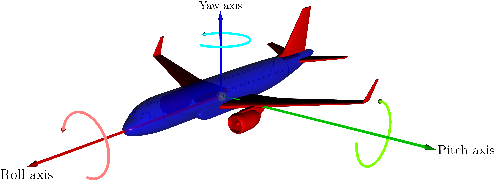
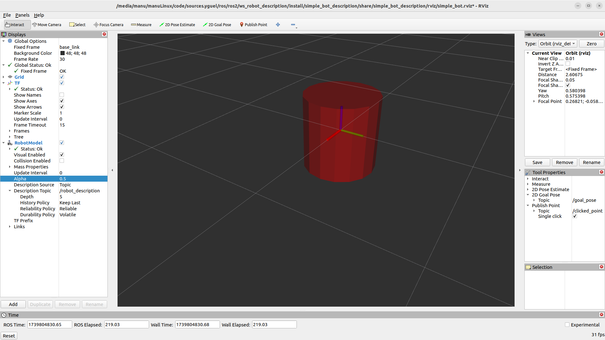

==================================================
URDF pour la description de robots non parallèles
==================================================

.. figure:: resources/fig/igraph/scanbot_kinematic_chain/slide003_scanbot_kinematic_chain.svg
   :name: fig_slide003_scanbot_kinematic_chain
   :align: center
   :height: 400px

   Robot Scanbot, et sa chaîne cinmématique.

Dans le cas d'un robot non parallèle, les chaînes cinématiques sont ouvertes et on peut représenter l'ensemble des chaînes cinématiques du robot par un arbre, le chemin en ligne directe de la racine à une feuille de l'arbre correspondant à une chaîne cinématique.

Le format utilisé pour décrire les robots non parallèle dans ROS est l'URDF.
Nous allons maintenant décrire la syntaxe de l'URDF.

-----------------------
Généralités sur le XML
-----------------------

L'URDF est basé sur le format XML, les éléments d'information sont organisés grâce à des balises :code:`<balise> élément </balise>`, qui peuvent être imbriquées. 
En anglais une balise est appelée un **tag**.

**Tag**
Un tag est une construction de balisage qui commence par :code:`<`` et se termine par :code:`>`. Il existe trois types de tag :

#. tag de début, tel que :code:`<section>`,
#. tag de fin, tel que :code:`</section>`,
#. tag sans élément, tel que :code:`<line-break />`.

Un tag peut être sans élément, car l'information peut-être contenue dans l'attribut de la balise (attribute en anglais).

**Attribut**
Un attribut est une construction de balisage qui consiste en une paire nom-valeur qui existe dans un tag de début ou un tag sans élément.
Un exemple est :code:`<link name="base_link">`, où le nom de l'attribut est "name" et sa valeur est "base_link".
Un tag peut avoir plusieurs attributs, mais chaque attribut ne peut apparaître qu'une seule fois dans une balise.

**Élément**
Un élément est une composante logique d'un document qui commence soit par un tag de début et se termine par un tag de fin correspondant, soit consiste uniquement en un tag sans élément. Les caractères entre la balise de début et la balise de fin, s'il y en a, sont le contenu de l'élément, et peuvent contenir du balisage, y compris d'autres éléments, appelés éléments enfants. 

.. _example_xml_element:
.. literalinclude:: resources/urdf/joint_element.urdf
   :language: xml
   :caption: Exemple d'un élément xml
   :linenos:
   :emphasize-lines: 2-10 

-----------------------
Généralités sur l'URDF
-----------------------

**Dans le format URDF**, il existe de nombreuses balises différentes qu'il est possible d'utiliser.
Elles sont toutes décrites dans la `documentation officielle de ROS du format URDF <http://wiki.ros.org/urdf/XML>`_ .
Il y en a trois principales qu'il faut connaître **robot**, **link** et **joint**.

**Le tag robot et le préambule XML**
Un fichier XML correct doit avoir un préambule XML dans la première ligne, et juste après cela, il contient une balise (appelée la balise racine), dans laquelle toutes les autres balises sont imbriquées. 
Pour un fichier URDF, cette balise racine sera la balise **robot**, et la seule chose à noter ici pour l'instant est que nous pouvons définir l'attribut name qui nous permet de spécifier le nom de notre robot.

.. code-block:: xml

   <?xml version="1.0"?>
   <robot name="my_robot">
      ...
      toutes les autres balises
      ...
   </robot>

Les 2 balises principales de l'URDF sont **link** et **joint** et sont au même niveau d'imbrication à la base de la balise **robot**:

.. code-block:: xml

   <?xml version="1.0"?>
   <?xml-model href="https://raw.githubusercontent.com/ros/urdfdom/master/xsd/urdf.xsd" ?>
   <robot name="my_robot" xmlns="http://www.ros.org">
      <link> ... </link>
      <link> ... </link>
      <link> ... </link>

      <joint>  ....  </joint>
      <joint>  ....  </joint>
      <joint>  ....  </joint>
   </robot>
   

-------------------
La balise **link**
-------------------

La balise **link** est utilisée pour décrire un segment du robot.
La description complète de cette balise est disponible dans la `specification de la balise link <http://wiki.ros.org/urdf/XML/link>`_.

.. grid:: 1 2 2 2

   .. grid-item-card::
  
      .. literalinclude:: resources/urdf/complete_link_tag.urdf
         :language: xml
         :linenos:
         :caption: Balise link avec les éléments **visual**, **material**, **collision** et **inertial**

   .. grid-item-card::

      .. figure:: resources/img/urdf/urdf_link2.png
         :name: fig_link_element
         :align: center
         :height: 400px

         Élément link d'un fichier URDF

Nous allons maintenant nous attacher à comprendre les différents repères utilisés dans la description d'un segment d'un robot et comment les définir dans un fichier URDF.

Dans le tag **origin** (tag **visual** ou **collision**), la position et l'orientation du repère du segment par rapport au repère du parent sont définis par les attributs **xyz** et **rpy**.|br|

#. La translation est définie par les attributs **xyz** qui sont les coordonnées x, y et z du repère du segment par rapport au repère du parent.
#. La rotation est définie par les attributs **rpy** qui sont les angles de rotation autour des axes x, y et z du repère du segment par rapport au repère du parent. **rpy** désigne «roll,pitch,yaw» ou en français: «roulis,tangage,lacet».

La rotation est toujours appliquée avant la translation et les rotations sont effectuées dans l'ordre **roll**, **pitch** puis **yaw** suivant le schéma ci-dessous:

   Rotations roll, pitch et yaw.

----------------
Simple exemple
----------------

Créons une simple description de robot URDF. |br|
Pour cela nous allons utiliser l'outil de visualisation de modèles URDF fourni par ROS2: **rviz2**. |br|
Afin de faciliter cette étape nous allons créer un package ROS2 dédié à la visualization en utilisant l'outil développé par IRIS **template2instance**. |br|
Cette outil permet de créer facilement un package ROS2 à partir d'un template. |br|
Pour cela nous avons besoin du template **view_robot_template** qui est un template de package ROS2 dédié à la visualisation de robots en utilisant rviz2. |br|

Installation de template2instance
^^^^^^^^^^^^^^^^^^^^^^^^^^^^^^^^^

#. Installer poetry en suivant les `instructions du site officiel <https://python-poetry.org/docs/#installing-with-the-official-installer>`_.

#. Créer un répertoire **system** dans votre workspace ROS2. Ajoutez un fichier **COLCON_IGNORE** dans ce répertoire pour éviter que les packages créés par template2instance soient compilés par colcon, le système de build de ROS2.

.. code-block:: bash

   mkdir -p ~/ros2_ws/system
   touch ~/ros2_ws/system/COLCON_IGNORE

#. Copier le module python **template2instance** dans le répertoire **ros2_ws/system** de votre workspace ROS2.
#. Exécutez la commande suivante:

.. code-block:: bash

   cd ~/ros2_ws/system/template2instance && poetry install && cd -

#. Copier le template **view_robot_template** dans le répertoire **ros2_ws/system** de votre workspace ROS2.

template2instance est un outil python utilisant le gestionnaire de dépendances **poetry** qui s'utilise de la manière suivante:

.. code-block:: bash

   poetry run create path_to_template path_to_new_package [--config path_to_config.json]

Créons un package ROS2 nommé **simple_bot_description** ayant le fichier de configuration suivant. |br|

.. literalinclude:: resources/code/template2instance/pkg_gen_cfg_view_simple_bot.json
   :language: json
   :caption: Configuration pour la génération du package simple_bot_description

#. :download:`Télécharger le fichier de configuration <resources/code/template2instance/pkg_gen_cfg_view_simple_bot.json>` et le copier dans le répertoire :code:`~/ros2_ws/system/template2instance/configs/pkg_gen_cfg_view_simple_bot.json`.

#. Exécuter la commande suivante: 

.. code-block:: bash

   cd ~/ros2_ws/system/template2instance && poetry run create ~/ros2_ws/system/view_robot_template ~/ros2_ws/src/simple_bot_description --config ~/ros2_ws/system/template2instance/configs/pkg_gen_cfg_view_simple_bot.json && cd -

#. Testez le package en le compilant:

.. code-block:: bash

   cd ~/ros2_ws
   ros2_humble
   ros2_build_only simple_bot_description

Lancez le package:

.. code-block:: bash

   ros2 launch simple_bot_description view_simple_bot.launch.py

Si tout s'est bien passé, vous devriez voir un dans rviz2 le robot par défaut:

.. figure:: resources/img/urdf/scanbot_cam/default_rviz_view.png
   :name: fig_default_rviz_view
   :align: center
   :height: 400px

   Le robot par défaut à l'initialisation d'un package de visualisation à partir du template view_robot_template.

Le fichier URDF se trouve dans le répertoire :code:`~/ros2_ws/src/simple_bot_description/urdf/simple_bot/simple_bot_macro.xacro` .

Ouvrez ce fichier et modifiez le pour qu'il ressemble à ceci:

.. grid:: 1 2 2 2

   .. grid-item-card::
  
      .. literalinclude:: resources/urdf/my01_bot.urdf
         :language: xml
         :linenos:
         :caption: Exemple minimal d'un fichier URDF avec un robot à un seul segment

   .. grid-item-card::

      .. figure:: resources/img/urdf/cylinder_link.png
         :name: fig_cylinder_link
         :align: center
         :height: 400px

         Affichage d'un segment cylindre avec RVIZ correspondant à la précédente description URDF

Fermez toutes les fenêtre et tapez CTRL-C dans le terminal puis relancez le package:

.. code-block:: bash

   ros2 launch simple_bot_description view_simple_bot.launch.py

La :numref:`fig_cylinder_link` montre le segment cylindre tel qu'il devrait s'afficher dans rviz2.

Pour comprendre comment les systèmes de coordonnées fonctionnent, il faut afficher les axes.
Dans rviz:

#. dans le panneau de gauche (''Displays''), dans **RobotModel** modifiez la valeur de **Alpha** à 0.5. Cela change la transparence du modèle du robot et permet de voir les axes.
#. Si vous ne voyez pas les axes, vérifiez que vous avez bien un **TF** et sinon ajoutez un **TF** dans le panneau de gauche (''Displays'') avec le bouton **Add**. Et vérifiez bien que **Show Axes** est coché.

   Affichage d'un segment cylindre avec RVIZ avec les axes visibles (Alpha=0.5, Show Axes : coché)

.. admonition:: Segments définis par des primitives géométriques

   Un segment peut être défini à partir de 3 formes géométriques de base: 
   
   #. pavé droit: :code:`<box size="10 20 40"/>`. Les tailles des côtés (''size'') sont données dans l'ordre x,y,z. Les côtés du pavé droit sont parallèles aux axes x, y et z.
   #. cylindre: :code:`<cylinder radius="10" length="40"/>` l'axe est toujours l'axe z.
   #. sphère: :code:`<sphere radius="10"/>`

   Dans ce cas le repère du segment est par défaut au centre de la forme géométrique (centre de gravité).

Nous allons modifier la forme pour utiliser un pavé droit. Cela nous permettra de bien visualiser l'orientation de la forme dans les 3 dimensions. |br|
Et nous allons modifier l'élément **origin** pour déplacer le repère du segment par rapport au repère du parent. |br|
Modifiez donc le fichier URDF pour qu'il ressemble à ceci:

.. grid:: 1 2 2 2

   .. grid-item-card::
  
      .. literalinclude:: resources/urdf/my02_bot.urdf
         :language: xml
         :linenos:
         :caption: Exemple minimal d'un fichier URDF avec un robot box (pavé droit) à un seul segment et une translation de l'origine.

   .. grid-item-card::

      .. figure:: resources/img/urdf/cylinder_link.png
         :name: fig_cylinder_link_my02_bot
         :align: center
         :height: 400px

         Affichage d'un segment pavé droit avec RVIZ correspondant à la précédente description URDF