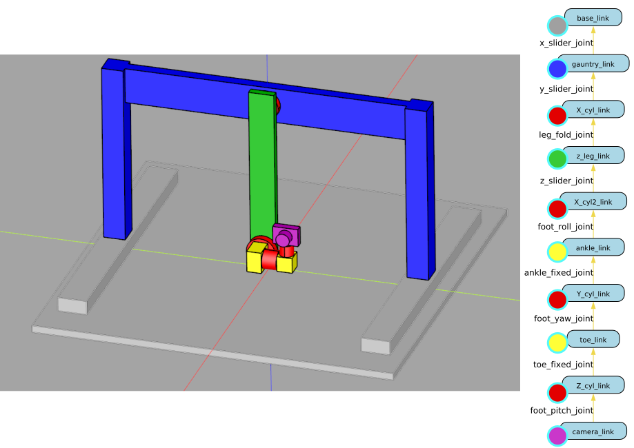
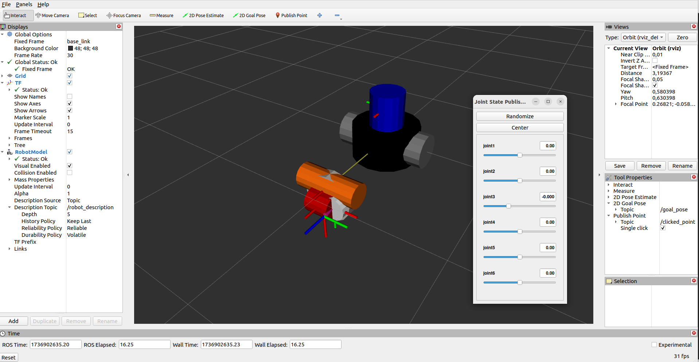

==================================
URDF par la pratique: le scanbot
==================================

   Robot Scanbot, le robot d'exemple non parallèle, et sa chaîne cinmématique.

Pour pratiquer nous allons utiliser un robot simple d'exemple que nous avons appelé scanbot.
Il se compose d'une partie en translation x,y,z, d'un bras vert capable de pivoter autour de l'axe x et d'un système à 3 degrées de liberté en rotation supportant une caméra à son orgnage terminal (voir la :numref:`fig_slide003_scanbot_kinematic_chain`).

------------------------
Maillages des segments
------------------------

Format step
^^^^^^^^^^^^

Les maillages des segments du scanbot au format step sont les suivants:

#. :download:`scanbot_s00_base_link.step <resources/3d/scanbot/scanbot_s00_base_link.step>`,
#. :download:`scanbot_s01_gauntry_link.step <resources/3d/scanbot/scanbot_s01_gauntry_link.step>`,
#. :download:`scanbot_s02_x_cyl_link.step <resources/3d/scanbot/scanbot_s02_x_cyl_link.step>`,
#. :download:`scanbot_s03_z_leg_link.step <resources/3d/scanbot/scanbot_s03_z_leg_link.step>`,
#. :download:`scanbot_s05_ankle_link.step <resources/3d/scanbot/scanbot_s05_ankle_link.step>`,
#. :download:`scanbot_s06_y_cyl_link.step <resources/3d/scanbot/scanbot_s06_y_cyl_link.step>`,
#. :download:`scanbot_s07_toe_link.step <resources/3d/scanbot/scanbot_s07_toe_link.step>`,
#. :download:`scanbot_s08_z_cyl_link.step <resources/3d/scanbot/scanbot_s08_z_cyl_link.step>`,
#. :download:`scanbot_s09_camera_link.step <resources/3d/scanbot/scanbot_s09_camera_link.step>`

.. admonition:: Exercice

   À partir des maillages ci-dessus au format step, utilisez un logiciel de CAO pour les convertir au format collada (.dae).
   Indice: Utilisez le logiciel FreeCAD.

.. .. admonition:: Exercice avancé

..    À partir de l'API python de FreeCAD, écrivez un script qui automatise la conversion des fichiers step en fichiers collada.

Format collada (.dae)
^^^^^^^^^^^^^^^^^^^^^

Les maillages des segments du scanbot au format collada sont les suivants:

#. :download:`scanbot_s00_base_link.dae <resources/3d/scanbot/scanbot_s00_base_link.dae>`,
#. :download:`scanbot_s01_gauntry_link.dae <resources/3d/scanbot/scanbot_s01_gauntry_link.dae>`,
#. :download:`scanbot_s02_x_cyl_link.dae <resources/3d/scanbot/scanbot_s02_x_cyl_link.dae>`,
#. :download:`scanbot_s03_z_leg_link.dae <resources/3d/scanbot/scanbot_s03_z_leg_link.dae>`,
#. :download:`scanbot_s05_ankle_link.dae <resources/3d/scanbot/scanbot_s05_ankle_link.dae>`,
#. :download:`scanbot_s06_y_cyl_link.dae <resources/3d/scanbot/scanbot_s06_y_cyl_link.dae>`,
#. :download:`scanbot_s07_toe_link.dae <resources/3d/scanbot/scanbot_s07_toe_link.dae>`,
#. :download:`scanbot_s08_z_cyl_link.dae <resources/3d/scanbot/scanbot_s08_z_cyl_link.dae>`,
#. :download:`scanbot_s09_camera_link.dae <resources/3d/scanbot/scanbot_s09_camera_link.dae>`

-----------------
Produire un URDF
-----------------

Nous allons décrire ce robot en URDF. |br|
Pour cela nous allons utiliser l'outil de visualisation de modèles URDF fourni par ROS2: **rviz2**. |br|
Afin de faciliter cette étape nous allons créer un package ROS2 dédié à la visualization en utilisant l'outil développé par IRIS **template2instance**. |br|
Cette outil permet de créer facilement un package ROS2 à partir d'un template. |br|
Pour cela nous avons besoin du template **view_robot_template** qui est un template de package ROS2 dédié à la visualisation de robots en utilisant rviz2. |br|

template2instance est un outil python utilisant le gestionnaire de dépendances **poetry** qui s'utilise de la manière suivante:

.. code-block:: bash

   poetry run create path_to_template path_to_new_package [--config path_to_config.json]

Caméra et 3 degrées de liberté en rotation
^^^^^^^^^^^^^^^^^^^^^^^^^^^^^^^^^^^^^^^^^^

Commençons simplement par décrire la caméra et les 3 degrées de liberté en rotation. |br|
Pour cela, créons un package ROS2 nommé **scanbot_cam_description** à partir du template **view_robot_template**. |br|

C'est une bonne pratique de mettre les fichiers URDF dans un package ROS2 dédié à la description du robot et appelé my_robot_name_**description**. |br|

Pour cela copier/éditer pour adapter à votre cas le fichier de configuration suivant:

.. literalinclude:: resources/code/template2instance/pkg_gen_cfg_view_scanbot_camera.json
   :language: json
   :caption: Configuration pour la génération du package scanbot_cam_description

On suppose que vous avez installé poetry et que template2instance est installé dans :code:`~/system/template2instance`. |br|
Copiez le fichier de configuration à l'emplacement :code:`~/system/template2instance/config/pkg_gen_cfg_view_scanbot_camera.json`. |br|

Puis exécuter la commande suivante:

.. code-block:: bash

   cd ~/system/template2instance
   poetry run create path_to_view_robot_template/view_robot_template ~/ws_ros2/src/scanbot_cam_description --config ~/system/template2instance/config/pkg_gen_cfg_view_scanbot_camera.json

Compiler le package:

.. code-block:: bash

   cd ~/ws_ros2
   ros2_humble
   ros2_build

Testez le package:

.. code-block:: bash

   ros2 launch scanbot_cam_description view_scanbot_camera.launch.py

   Le robot par défaut à l'initialisation d'un package de visualisation à partir du template view_robot_template.