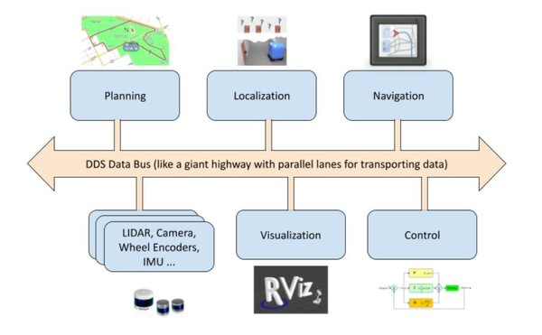

*****
DDS
*****

.. figure:: resources/img/ros-architecture.jpg
      :name: fig_ros2_architecture
      :align: center

Le Data Distribution Service (DDS) est au cœur de l’architecture de ROS2 pour gérer la communication entre les nœuds. |br| 
DDS assure: la découverte automatique des éditeurs (publishers) et abonnés (subscribers) sur le réseau, la gestion de la qualité de service (QoS) et le transport des messages. 

Grâce à DDS, les nœuds ROS2 peuvent échanger des données de manière fiable, sécurisée et en temps réel ou pseudo temps réel.

=============================
Caractéristiques clés de DDS
=============================

#. Découverte automatique : Pas besoin de configurer manuellement les adresses IP ou les ports.
#. Qualité de service (QoS) : Permet de définir différents niveaux de fiabilité, durées de vie des messages, etc.
#. Pub/sub : Modèle d’abonnement-publication, les nœuds peuvent publier et s’abonner sur les mêmes topics sans se connaître directement.
#. DDS permet de gérer de manière transparente et unifiée la communication locale à base d'IPC ainsi que la communication réseau. DDS fournit une seule couche d'abstraction tout en garantissant la compatibilité entre les deux modes de communication et en assurant à la fois une communication :

   #. la plus temps réel possible,
   #. fiable,
   #. sécurisée.

.. _ipc_dds:

===========
IPC et DDS
===========

Qu’est-ce qu’une IPC ?
-----------------------

L’*Inter-Process Communication (IPC)* regroupe l’ensemble des mécanismes et protocoles
permettant à plusieurs processus d’échanger des données et de coordonner leurs actions
sur la même machine. Parmi les techniques les plus courantes, on retrouve la mémoire
partagée (*shared memory*), les *pipes*, les *sockets* et les files de messages
(*message queues*). En exploitant ces mécanismes, il est possible d’atteindre de très
bonnes performances en termes de temps de latence et de débit, ce qui est essentiel
dans des systèmes où le temps de réaction doit être le plus court possible (temps
réel ou quasi temps réel).

Aspects clés de l’IPC
----------------------

- **Communication locale efficace** : Les mécanismes IPC tels que la mémoire partagée,
  les *pipes*, les *sockets* et les files de messages permettent une communication
  performante entre nœuds sur une même machine, sans l’overhead lié à la communication
  réseau.

- **Partage de ressources** : L’IPC offre la possibilité de mettre en commun des ressources
  (e.g., buffers de données, primitives de synchronisation) pour assurer une coordination
  et un traitement collaboratif entre différents composants ou processus.

- **Faible latence** : En se dispensant des protocoles réseau, les solutions d’IPC permettent
  d’obtenir des transmissions à faible latence, répondant ainsi aux contraintes strictes
  de certaines applications robotiques, notamment en contrôle temps réel ou pour le
  traitement rapide de données capteurs.

DDS arbitre entre IPC et protocoles réseau
-------------------------------------------

Dans le cas d’une communication locale (plusieurs nœuds s’exécutant sur la même machine),
DDS tire parti des mécanismes d’IPC pour réduire la latence et limiter la consommation
de ressources. Pour une communication à travers un réseau distribué, DDS s’appuie sur des
protocoles réseau (TCP ou UDP) afin de diffuser les données entre différents systèmes,
tout en conservant les mêmes principes de découverte automatique et de Qualité de Service (QoS).

DDS exploite ces mécanismes d’IPC pour garantir un échange de données rapide
et efficace à l’échelle locale, tout en offrant simultanément une infrastructure robuste
pour la communication réseau. 

=============================
Implémentations de DDS
=============================

Pour configurer DDS dans ROS2, vous pouvez définir la variable d’environnement :code:`RMW_IMPLEMENTATION` (pour ROS Middleware Implementation) afin de spécifier l’implémentation DDS à utiliser (par exemple : FastDDS (anciennement Fast-RTPS), CycloneDDS, Connext, etc.).

Voir la documentation: `travailler avec différents DDS <https://docs.ros.org/en/humble/How-To-Guides/Working-with-multiple-RMW-implementations.html>`_

Exemple :

.. code-block:: bash

   export RMW_IMPLEMENTATION=rmw_fastrtps_cpp ros2 run demo_nodes_cpp talker

.. note::

   Par défaut, ROS2 utilise l’implémentation FastDDS d'eProsima.
   FastDDS est une implémentation open-source du standard DDS maintenue par la fondation Eclipse au travers d'eProsima.
   Il est possible de choisir une autre implémentation si elle est installée sur le système.